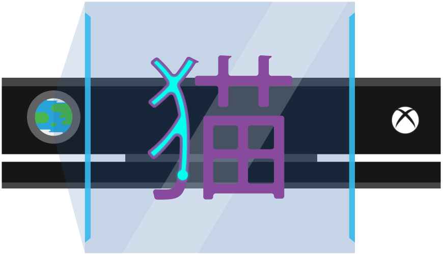

# Kinecting the World
A Kinect game to making learning Simplified Chinese fun

#### This project was made for IC Hack 17 (at Imperial College London). Here's the link to [devpost](https://devpost.com/software/colorbasics) and the [guest blog](https://blogs.msdn.microsoft.com/uk_faculty_connection/2017/02/14/kinect-cognitive-with-kinecting-the-world-guest-blog-from-ichack17-microsoft-challenge-winners/) for winning Microsoft's Challenge (Cognitive Services).

## What does it do?

Kinecting the world is a multiplayer language learning game that comes with training and game mode. In training mode the player(s) can teach themselves Chinese by saying “Translate \<English word/sentence\>”, after which the recognised word is translated to Simplified Chinese. On the screen the player sees himself in the video stream from the Kinect with the translated Chinese symbols overlaid on top. By extending the hand towards the screen each player can trace the Chinese characters. Traces of more than one player are displayed in different brush colours. At any point through the game, the Chinese characters and brush strokes can be cleared by saying “Cancel”. In game mode the player follows a both addictive and instructive story line that will teach some basic Chinese characters while the player fights his way from level to level to find the evil monster that has taken over Queen’s Tower (an iconic structure at Imperial College London).

## Requirements
* Kinect for Windows SDK
* Microsoft Kinect
* Microsoft Cognitive Services Subscription Key (for Bing Speech Recognition and Translation)
